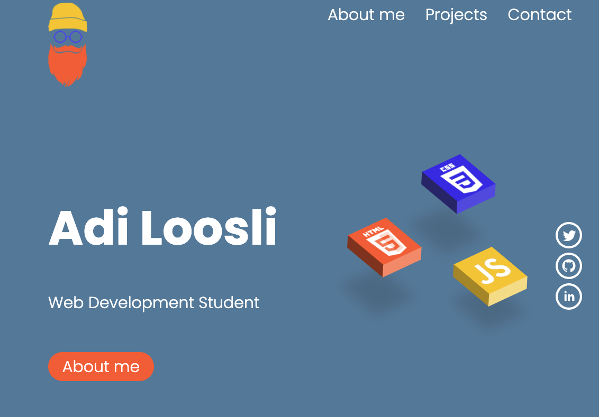

# Responsive Portfolio Website

## Description

Our task was to create a responsive  Portfolio website that displays the projects we did so far. I have used both flexbox and css grid to accomplish this.
It is rather rough around the edges, i will continue to work on it and make improvements as i learn more.
***
## Screenshot

***
## Credits

I got a lot of help from this tutorial
https://www.youtube.com/watch?v=-D6oTPA4vXc
***
## Deployment

To see it in action, click the badge! 

